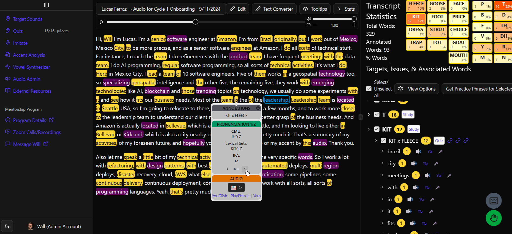

# Simple American Accent Web App

> 📝 **Portfolio Repository — Proprietary Code (No External Contributions)**

A full-stack web application for American accent training and feedback.

- Used by my accent coaching clients (Brazilians who want an American accent)
- React, Node & Express, PostgreSQL & Prisma, Tailwind, Vite



Important context:

- I made this repo public solely so potential employers can see my code as I pursue full-stack engineering roles.
- This repo began as a private codebase powering a tool for my accent coaching clients. I built fast, iterated constantly, and focused on solving real problems... not on preparing the codebase for outside review or large-scale deployment. The app supports my service business, so many features were built quickly in response to real client needs. I continue to iterate and improve the app today.
- When I realized full-stack engineering could be a parallel career path (while continuing to run my business), I made the repo public and began professionalizing it: refactoring, improving structure, adding tests, and documenting decisions. I've been learning and growing a lot as an engineer through this process.
- Because of its history, the codebase is a mix. Some parts of the code were meticulously hand-coded. Other parts were AI-assisted or even "vibe coded" to get client feedback faster. I'm working on documenting that evolution more clearly.

<details><summary>Demo</summary>
  
- 5 min video [here](https://youtu.be/1I5FPCRFm7o)
- Live app demo:
  - [Link](https://app.simpleamericanaccent.com)
  - User/pass: demo@simpleamericanaccent.com / Demo123!
</details>

<details><summary>App Overview</summary>

### Tech Stack

- **Frontend:** React 19, Vite, Tailwind, shadcn
- **Backend:** Node.js, Express, Prisma, PostgreSQL on Render, Airtable via API, Auth0
- **Cloud & DevOps:** Render, CloudFlare, AWS S3
- **Testing & Tooling:** Git, GitHub, pnpm, Jest, Storybook
- **AI-Assisted Engineering:** Cursor, ChatGPT
- **App Analytics:** PostHog coming soon

### Architecture

This is a monorepo with thin app wrappers around shared core packages:

```
apps/ (thin wrappers around shared core packages)
 ├── user-web
 ├── user-api
 ├── admin-web
 ├── admin-api
 └── python-experiments
packages/ (shared core)
 ├── frontend               → Quiz system, transcript viewer, phoneme tools, admin pages
 └── backend                → Auth0, Prisma, rate limiting, Airtable, API routes
```

### Features

- **Quiz System** - Minimal pairs pronunciation quiz
- **Transcript Viewer** - Audio playback time-aligned with transcript, admin view for annotating accent feedback, user view for viewing accent feedback
- **Progress Tracking** - Visual progress indicators and performance statistics
- **Admin Dashboard** - User management, trial analytics, and client acquisition tracking

### Security

- **Authentication** - Auth0 integration
- **Authorization** - Role-based access control (admin vs user) + user-specific permissions
- **Rate Limiting** - 450 requests per 15 minutes per IP address
- **Configuration Management** – Environment-based secrets and keys (no credentials in source)

</details>
<details><summary>Development Setup</summary>
  
### Main Setup

- Set up [mkcert](https://github.com/FiloSottile/mkcert) to enable local development (localhost) over HTTPS
- Navigate to repo root
- **Run setup command (will install dependencies, generate Prisma client, setup localhost mkcert certificates, and create 4 .env files):**
  ```powershell
  pnpm run setup
  ```
- **Environment Setup:** Fill in your credentials in the 4 .env files (see console log information after running setup)
- **Run the application:**
  ```powershell
  pnpm dev    # Start user app
  # or
  pnpm dev:a   # Start admin app
  ```

### Database Setup (if needed)

- **Airtable Setup:** Set up your own Airtable base for accent annotations data (schema available in codebase)
- **Database Setup:**

  - **Setup:** Run migrations:
    ```powershell
    pnpm migrate
    ```
  - **Seeding:** Populate with pronunciation dictionary data:
    ```powershell
    pnpm seed:cmu
    ```

### Optional Tools

- **Prisma Studio:** Open database GUI
  ```powershell
  pnpm studio
  ```
- **Direct database access via psql:** Log into Render dashboard, copy connection command, paste into terminal and hit enter. Then copy and paste the password (it will appear invisible in the terminal) and hit enter.
</details>
<details><summary>License & Contributing</summary>

This repository is **proprietary** and made public **solely for portfolio and demonstration purposes** as part of my full-stack engineering job search.

- **License:** See [LICENSE.md](https://github.com/SimpleAmericanAccent/saa-app-web?tab=License-1-ov-file#readme)
- **Contributing:** See [CONTRIBUTING.md](https://github.com/SimpleAmericanAccent/saa-app-web?tab=contributing-ov-file#readme)

External contributions (issues, PRs, forks) are not accepted.

</details>
